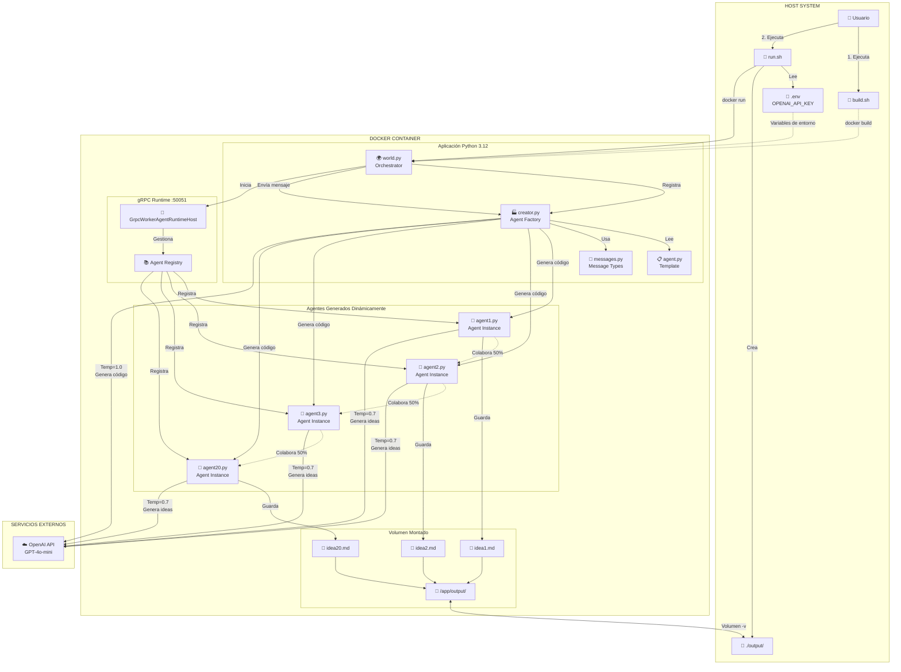
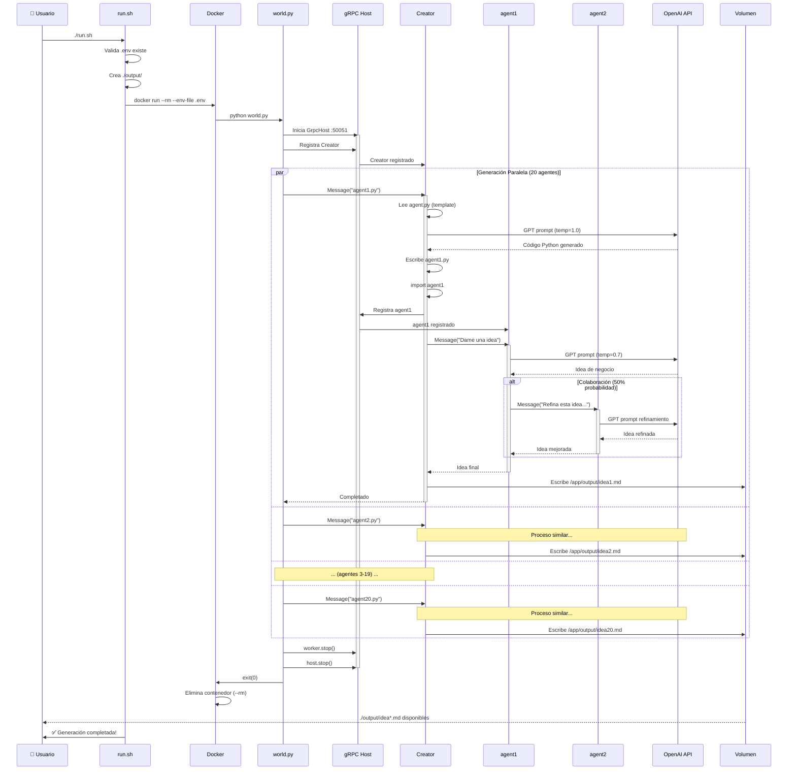
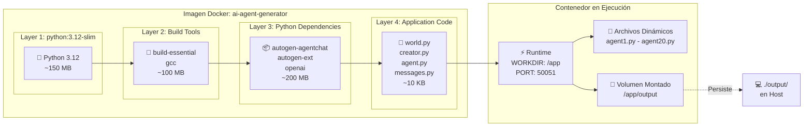
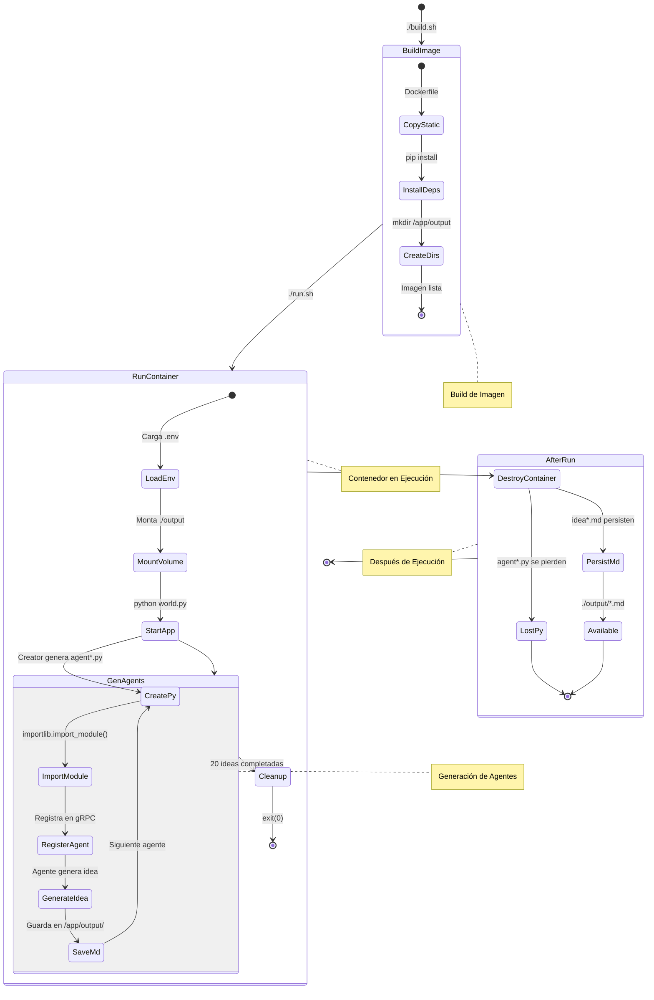
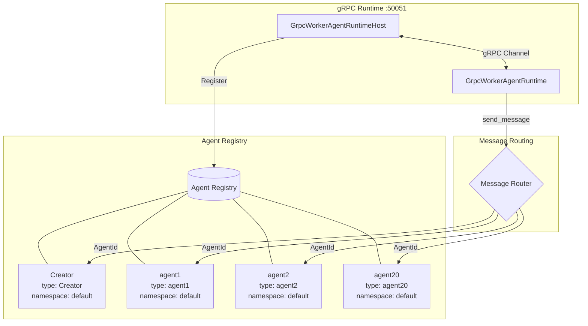
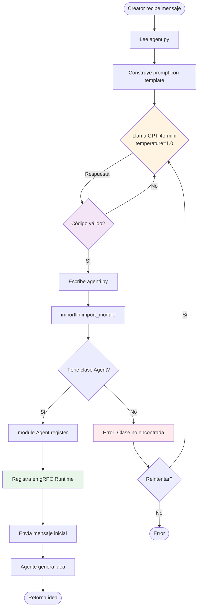
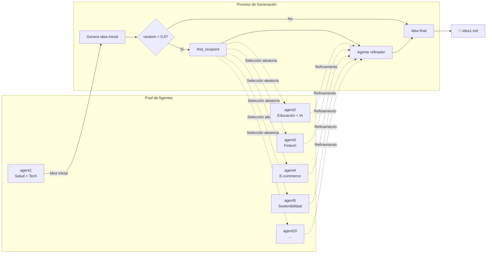
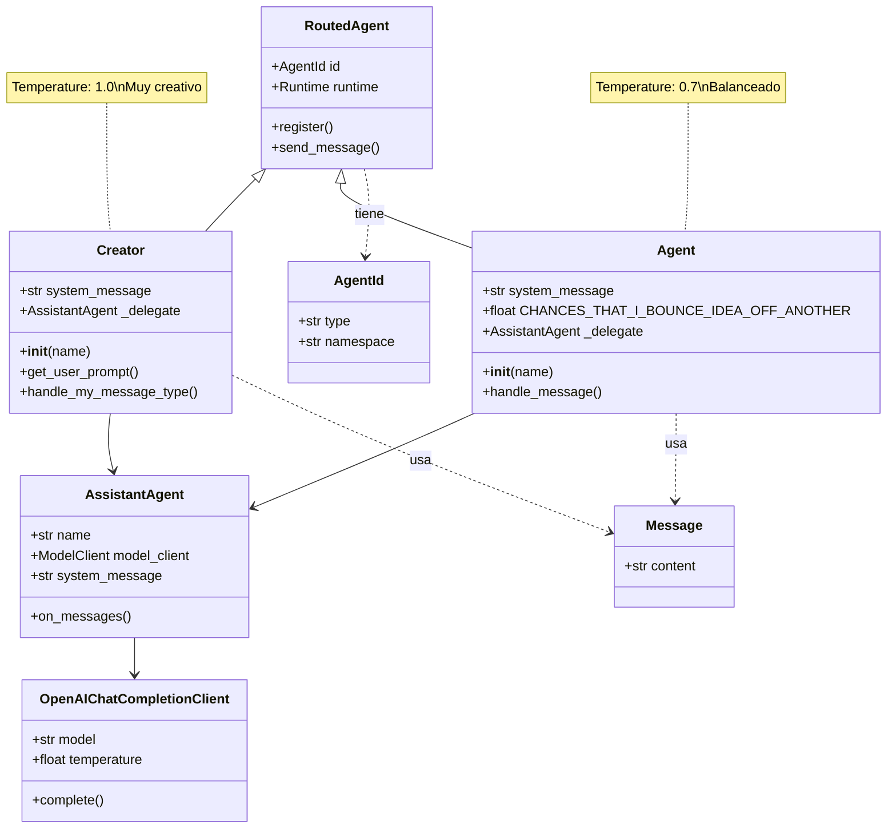

# Arquitectura del Sistema - AI Agent Generator

## Diagrama de Arquitectura General

## Diagrama de Flujo de Ejecución

## Diagrama de Componentes Docker

## Diagrama de Ciclo de Vida de Archivos

## Diagrama de Comunicación gRPC

## Diagrama de Generación de Código Dinámico

## Diagrama de Colaboración entre Agentes

## Diagrama de Estructura de Datos

