# Arquitectura del Sistema - AI Agent Generator

## Diagrama de Arquitectura General

```mermaid
graph TB
    subgraph HostSystem["HOST SYSTEM"]
        User[👤 Usuario]
        BuildSh[📜 build.sh]
        RunSh[📜 run.sh]
        EnvFile[🔑 .env<br/>OPENAI_API_KEY]
        OutputDir[📁 ./output/]

        User -->|1. Ejecuta| BuildSh
        User -->|2. Ejecuta| RunSh
        RunSh -->|Lee| EnvFile
        RunSh -->|Crea| OutputDir
    end

    subgraph DockerContainer["DOCKER CONTAINER"]
        subgraph AppPython["Aplicación Python 3.12"]
            World[🌍 world.py<br/>Orchestrator]
            Creator[🏭 creator.py<br/>Agent Factory]
            AgentTemplate[📋 agent.py<br/>Template]
            Messages[📨 messages.py<br/>Message Types]

            World -->|Registra| Creator
            World -->|Envía mensaje| Creator
            Creator -->|Lee| AgentTemplate
            Creator -->|Usa| Messages
        end

        subgraph GrpcRuntime["gRPC Runtime :50051"]
            GrpcHost[🔌 GrpcWorkerAgentRuntimeHost]
            AgentRegistry[📚 Agent Registry]

            World -->|Inicia| GrpcHost
            GrpcHost -->|Gestiona| AgentRegistry
        end

        subgraph AgentesGenerados["Agentes Generados Dinámicamente"]
            Agent1[🤖 agent1.py<br/>Agent Instance]
            Agent2[🤖 agent2.py<br/>Agent Instance]
            Agent3[🤖 agent3.py<br/>Agent Instance]
            AgentN[🤖 agent20.py<br/>Agent Instance]

            Creator -->|Genera código| Agent1
            Creator -->|Genera código| Agent2
            Creator -->|Genera código| Agent3
            Creator -->|Genera código| AgentN

            Agent1 -.->|Colabora 50%| Agent2
            Agent2 -.->|Colabora 50%| Agent3
            Agent3 -.->|Colabora 50%| AgentN
        end

        subgraph VolumenMontado["Volumen Montado"]
            ContainerOutput[📂 /app/output/]
            Idea1[📄 idea1.md]
            Idea2[📄 idea2.md]
            IdeaN[📄 idea20.md]

            Agent1 -->|Guarda| Idea1
            Agent2 -->|Guarda| Idea2
            AgentN -->|Guarda| IdeaN

            Idea1 --> ContainerOutput
            Idea2 --> ContainerOutput
            IdeaN --> ContainerOutput
        end

        AgentRegistry -->|Registra| Agent1
        AgentRegistry -->|Registra| Agent2
        AgentRegistry -->|Registra| Agent3
        AgentRegistry -->|Registra| AgentN
    end

    subgraph ServiciosExternos["SERVICIOS EXTERNOS"]
        OpenAI[☁️ OpenAI API<br/>GPT-4o-mini]

        Creator -->|Temp=1.0<br/>Genera código| OpenAI
        Agent1 -->|Temp=0.7<br/>Genera ideas| OpenAI
        Agent2 -->|Temp=0.7<br/>Genera ideas| OpenAI
        Agent3 -->|Temp=0.7<br/>Genera ideas| OpenAI
        AgentN -->|Temp=0.7<br/>Genera ideas| OpenAI
    end

    BuildSh -.->|docker build| World
    RunSh -->|docker run| World
    EnvFile -.->|Variables de entorno| World
    ContainerOutput <-->|Volumen -v| OutputDir
```

## Diagrama de Flujo de Ejecución

```mermaid
sequenceDiagram
    participant U as 👤 Usuario
    participant R as run.sh
    participant D as Docker
    participant W as world.py
    participant G as gRPC Host
    participant C as Creator
    participant A1 as agent1
    participant A2 as agent2
    participant O as OpenAI API
    participant V as Volumen

    U->>R: ./run.sh
    R->>R: Valida .env existe
    R->>R: Crea ./output/
    R->>D: docker run --rm --env-file .env
    D->>W: python world.py

    W->>G: Inicia GrpcHost :50051
    activate G
    W->>G: Registra Creator
    G->>C: Creator registrado

    par Generación Paralela (20 agentes)
        W->>C: Message("agent1.py")
        activate C
        C->>C: Lee agent.py (template)
        C->>O: GPT prompt (temp=1.0)
        O-->>C: Código Python generado
        C->>C: Escribe agent1.py
        C->>C: import agent1
        C->>G: Registra agent1
        G->>A1: agent1 registrado
        C->>A1: Message("Dame una idea")
        activate A1
        A1->>O: GPT prompt (temp=0.7)
        O-->>A1: Idea de negocio

        alt Colaboración (50% probabilidad)
            A1->>A2: Message("Refina esta idea...")
            activate A2
            A2->>O: GPT prompt refinamiento
            O-->>A2: Idea refinada
            A2-->>A1: Idea mejorada
            deactivate A2
        end

        A1-->>C: Idea final
        deactivate A1
        C->>V: Escribe /app/output/idea1.md
        C-->>W: Completado
        deactivate C
    and
        W->>C: Message("agent2.py")
        Note over C,O: Proceso similar...
        C->>V: Escribe /app/output/idea2.md
    and
        Note over W,C: ... (agentes 3-19) ...
    and
        W->>C: Message("agent20.py")
        Note over C,O: Proceso similar...
        C->>V: Escribe /app/output/idea20.md
    end

    W->>G: worker.stop()
    W->>G: host.stop()
    deactivate G
    W->>D: exit(0)
    D->>D: Elimina contenedor (--rm)
    V-->>U: ./output/idea*.md disponibles
    R->>U: ✅ Generación completada!
```

## Diagrama de Componentes Docker

```mermaid
graph LR
    subgraph ImagenDocker["Imagen Docker: ai-agent-generator"]
        subgraph Layer1["Layer 1: python:3.12-slim"]
            Base[🐍 Python 3.12<br/>~150 MB]
        end

        subgraph Layer2["Layer 2: Build Tools"]
            BuildTools[🔧 build-essential<br/>gcc<br/>~100 MB]
        end

        subgraph Layer3["Layer 3: Python Dependencies"]
            Deps[📦 autogen-agentchat<br/>autogen-ext<br/>openai<br/>~200 MB]
        end

        subgraph Layer4["Layer 4: Application Code"]
            Code[📝 world.py<br/>creator.py<br/>agent.py<br/>messages.py<br/>~10 KB]
        end

        Base --> BuildTools
        BuildTools --> Deps
        Deps --> Code
    end

    subgraph ContenedorEjecucion["Contenedor en Ejecución"]
        Code --> Runtime[⚡ Runtime<br/>WORKDIR: /app<br/>PORT: 50051]
        Runtime --> Files[📁 Archivos Dinámicos<br/>agent1.py - agent20.py]
        Runtime --> Volume[💾 Volumen Montado<br/>/app/output]
    end

    Volume -.->|Persiste| HostOutput[💻 ./output/<br/>en Host]
```

## Diagrama de Ciclo de Vida de Archivos

```mermaid
stateDiagram-v2
    [*] --> BuildImage: ./build.sh

    state BuildImage {
        [*] --> CopyStatic: Dockerfile
        CopyStatic --> InstallDeps: pip install
        InstallDeps --> CreateDirs: mkdir /app/output
        CreateDirs --> [*]: Imagen lista
    }

    BuildImage --> RunContainer: ./run.sh

    state RunContainer {
        [*] --> LoadEnv: Carga .env
        LoadEnv --> MountVolume: Monta ./output
        MountVolume --> StartApp: python world.py

        state GenAgents {
            StartApp --> CreatePy: Creator genera agent*.py
            CreatePy --> ImportModule: importlib.import_module()
            ImportModule --> RegisterAgent: Registra en gRPC
            RegisterAgent --> GenerateIdea: Agente genera idea
            GenerateIdea --> SaveMd: Guarda en /app/output/
            SaveMd --> CreatePy: Siguiente agente
        }

        StartApp --> GenAgents
        GenAgents --> Cleanup: 20 ideas completadas
        Cleanup --> [*]: exit(0)
    }

    RunContainer --> DestroyContainer: docker rm

    state AfterRun {
        DestroyContainer --> LostPy: agent*.py se pierden
        DestroyContainer --> PersistMd: idea*.md persisten
        LostPy --> [*]
        PersistMd --> Available: ./output/*.md
        Available --> [*]
    }

    AfterRun --> [*]

    note right of BuildImage: Build de Imagen
    note right of RunContainer: Contenedor en Ejecución
    note right of GenAgents: Generación de Agentes
    note right of AfterRun: Después de Ejecución
```

## Diagrama de Comunicación gRPC

## Diagrama de Generación de Código Dinámico

## Diagrama de Colaboración entre Agentes

```mermaid
graph LR
    subgraph PoolAgentes["Pool de Agentes"]
        A1[agent1<br/>Salud + Tech]
        A2[agent2<br/>Educación + IA]
        A3[agent3<br/>Fintech]
        A4[agent4<br/>E-commerce]
        A5[agent5<br/>Sostenibilidad]
        AN[agent20<br/>...]
    end

    subgraph ProcesoGeneracion["Proceso de Generación"]
        Generate[Genera idea inicial]
        Random{random < 0.5?}
        FindRecipient[find_recipient]
        Refine[Agente refinador]
        Final[Idea final]

        Generate --> Random
        Random -->|No| Final
        Random -->|Sí| FindRecipient
        FindRecipient --> Refine
        Refine --> Final
    end

    A1 -->|Idea inicial| Generate
    FindRecipient -.->|Selección aleatoria| A2
    FindRecipient -.->|Selección aleatoria| A3
    FindRecipient -.->|Selección aleatoria| A4
    FindRecipient -.->|Selección aleatoria| A5
    FindRecipient -.->|Selección aleatoria| AN

    A2 -.->|Refinamiento| Refine
    A3 -.->|Refinamiento| Refine
    A4 -.->|Refinamiento| Refine
    A5 -.->|Refinamiento| Refine
    AN -.->|Refinamiento| Refine

    Final --> Output[💾 idea1.md]
```

## Diagrama de Estructura de Datos

